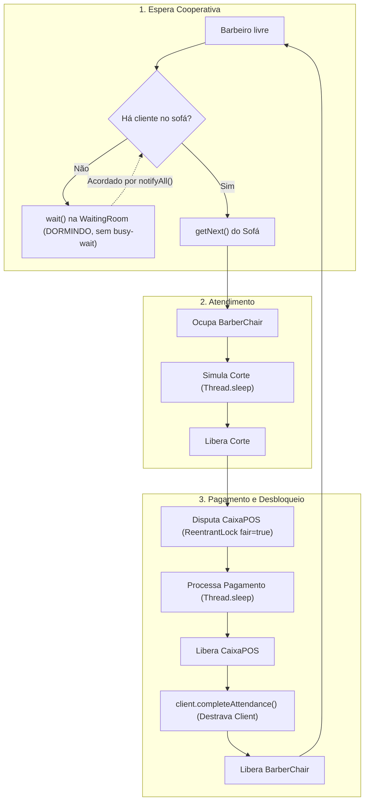

# Notas técnicas — Implementação e Concorrência da frente do Barbeiro

> Documento de apoio para o relatório da disciplina (Processamento Paralelo).
> Descreve a arquitetura de sincronização do Barbeiro, a exclusão mútua do CaixaPOS,
> a prevenção de busy-wait e os resultados empíricos dos testes de concorrência.

---

## 1. Visão Geral da Arquitetura do Barbeiro

A frente do Barbeiro é composta por três componentes essenciais:

1. **`Barber` (`Barbeiro.java` / `Barber.java`)**: Thread trabalhadora (`Runnable`) que modela o ciclo de vida de cada um dos 3 barbeiros.
2. **`BarberChair.java`**: Modela cada uma das 3 cadeiras físicas de corte, garantindo controle estrito de ocupação por barbeiro.
3. **`CaixaPOS.java`**: Recurso compartilhado exclusivo (1 única máquina para toda a barbearia) que serializa todos os pagamentos.



---

## 2. Decisões de Sincronização e Prevenção de Falhas

### 2.1 Prevenção de Busy-Wait (Espera Ocupada)
- **Problema:** Um laço `while (waitingRoom.isEmpty()) {}` consumiria 100% de CPU indevidamente enquanto a barbearia estivesse vazia.
- **Solução Implementada:** O barbeiro sincroniza no monitor compartilhado da `WaitingRoom` e invoca `waitingRoom.wait()`.
- **Acordar Confiável:** A `WaitingRoom.enter()` emite `this.notifyAll()` assim que um cliente entra na sala de espera, acordando instantaneamente os barbeiros adormecidos.

### 2.2 Exclusão Mútua da POS e Prevenção de Starvation
- **Problema:** 3 barbeiros terminando cortes concorrentemente disputam a mesma máquina de pagamento. Se um barbeiro for preterido repetidamente, ocorre *starvation*.
- **Solução Implementada:** Uso de `ReentrantLock(true)` (fairness habilitado) em `CaixaPOS.java`. A política FIFO no lock garante justiça no atendimento dos barbeiros que solicitam o pagamento.

### 2.3 Prevenção de Deadlock e "Lost Wake-up" na Saída do Cliente
- **Regra Rígida:** O cliente permanece bloqueado em `client.waitUntilAttended()` até que o barbeiro chame explicitamente `client.completeAttendance()`.
- **Garantia:** Em `Barber.java`, a chamada `client.completeAttendance()` é feita após a liberação da POS e dentro de bloco protegido com `try/catch/finally`, garantindo que mesmo sob interrupções o cliente nunca fique órfão/travado.

---

## 3. Resultados Empíricos dos Testes

### 3.1 Testes Manuais (`BarberManualTest.java`)
- **Caso 1 (1 Barbeiro, 1 Cliente):** Fluxo ponta a ponta validado com sucesso (atendimento, corte, POS e finalização).
- **Caso 2 (3 Barbeiros, 4 Clientes):** Concorrência entre cadeiras e barbeiros sem sobreposição de estado.
- **Caso 3 (Exclusão Mútua no POS):** 5 threads disputando a POS simultaneamente, 0 violações de exclusão mútua.
- **Caso 4 (Sono e Despertar):** Barbeiro entra em estado `SLEEPING` e é despertado cooperativamente pela chegada do cliente.
- **Resultado:** 13/13 asserções aprovadas.

### 3.2 Teste de Estresse (`BarberStressTest.java`)
- **Carga:** 50 threads de clientes por rodada, 3 barbeiros concorrentes, 1 POS única.
- **Repetições:** 10 rodadas consecutivas.
- **Métricas avaliadas:**
  - Deadlocks: **0 detectados** (todas as threads de clientes finalizaram em tempo hábil).
  - Integridade da POS: **100%** (número de transações no POS = número de clientes atendidos).
  - Exceções não tratadas: **0**.

```text
=================================================================
 RESULTADO FINAL: 0 de 10 rodadas tiveram problemas.
 [SUCESSO] Todos os testes passaram sem deadlock, sem excecoes e com exclusao mutua valida.
=================================================================
```

---

## 4. Subsídios para as Questões do Relatório

| Questão do Relatório | Como a implementação do Barbeiro responde |
| :--- | :--- |
| **Q1 (Visão Geral e Arquitetura)** | O `Barber` atua como thread consumidora do padrão produtor-consumidor multinível, orquestrado pela `WaitingRoom` e `CaixaPOS`. |
| **Q2 (Sincronização e Monitores)** | Utilização de monitores Java (`wait`/`notifyAll`) para sono/despertar e `ReentrantLock` para serialização de checkout. |
| **Q3 (Fairness e Starvation)** | `ReentrantLock(true)` no POS evita preterimento arbitrário de barbeiros; `WaitingRoom` garante FIFO no sofá. |
| **Q4 (Afinidade de CPU)** | Estrutura modular pronta para receber simulação de carga (50+ clientes) sob 1 núcleo e multicore. |
| **Q5 (Trade-offs)** | Comparação entre granularidade fina (lock individual da POS + monitor da sala) vs. lock global que estrangularia o paralelismo. |
